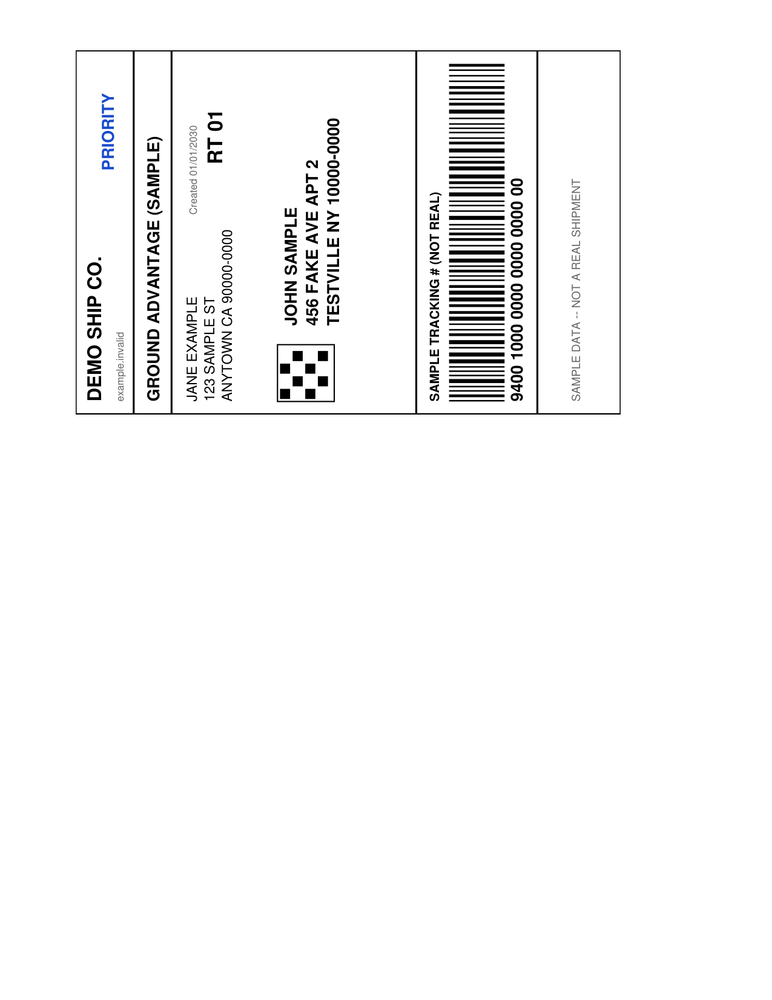
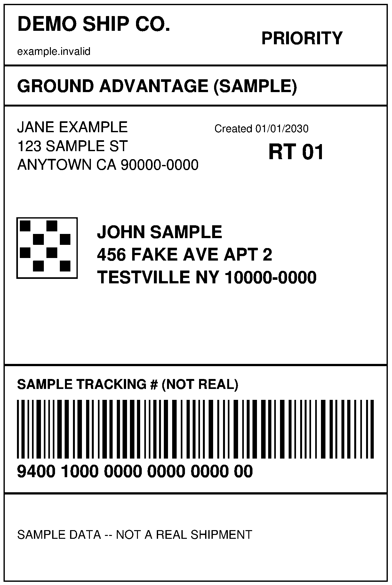
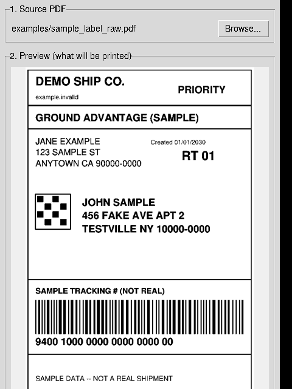

# Label Fixer

Extracts a 4x6 shipping label embedded in a full-page (Letter/A4) PDF and
prints it straight to a Windows label printer (e.g. Rongta RP245) at the
printer's own native resolution — no snip/Paint/rotate steps, which is
what was blurring the barcodes.

Two ways to use it:
- `gui.py` — point-and-click app: pick a PDF, see a preview of exactly
  what will print, pick a printer, hit Print.
- `label_print.py` — command-line version, same engine, scriptable.

Both share the same extraction/printing logic in `core.py`.

## Example

Carrier PDFs (USPS/UPS/FedEx/PirateShip/Shopify, etc.) commonly hand you
a full Letter-size page with the actual 4x6 label rotated into a corner
of it — that's the part that prints tiny/fuzzy if you just hit Ctrl+P.
`examples/sample_label_raw.pdf` is a synthetic label (fake name/address/
tracking number, not a real shipment) in exactly that shape, so you can
try the app immediately without needing a real label.

**Before** — the raw PDF as a carrier gives it to you:



**After** — auto-cropped, rotated upright, rendered at print resolution:



**The GUI**, after clicking Browse and selecting the sample file — the
preview pane already shows the corrected version:



Try it yourself:
```
uv run python gui.py
```
then Browse to `examples/sample_label_raw.pdf`.

## Setup (one time)

1. In Windows, set your label printer's default paper size to 4x6 in
   (Devices & Printers → your printer → Printing Preferences).
2. Install [uv](https://docs.astral.sh/uv/), then sync dependencies:
   ```
   uv sync
   ```
   (`pywin32` is only pulled in on Windows, for the actual printing step.)

## GUI

```
uv run python gui.py
```
or double-click **LabelFixer.bat**.

1. **Browse...** to pick the shipping-label PDF.
2. The app auto-crops and rotates it and shows a live preview — this is
   exactly what will be sent to the printer. If the rotation guessed
   wrong, change the **Rotation** dropdown and the preview updates.
3. Pick the **Printer** and **Copies**, check **Print all pages** for a
   multi-label PDF, then click **Print**.
4. **Save corrected PDF...** exports a cropped/rotated vector PDF as a
   fallback you can print from any PDF viewer at "Actual Size / 100%".

## CLI

Run everything through `uv run` so it uses the project's own environment:

```
# See installed printers and confirm the exact name Windows uses
uv run python label_print.py --list-printers

# Sanity-check the crop/rotation before printing anything (safe on any OS)
uv run python label_print.py examples/sample_label_raw.pdf --preview check.png --no-print

# Print to the default printer
uv run python label_print.py label.pdf

# Print to a specific printer, 2 copies
uv run python label_print.py label.pdf --printer "Rongta RP245" --copies 2

# Multi-label PDF (one label per page)
uv run python label_print.py batch.pdf --all-pages --printer "Rongta RP245"

# Save a corrected vector PDF as a fallback (open in any PDF viewer and
# print at "Actual Size / 100%, no scaling")
uv run python label_print.py label.pdf --save-pdf corrected.pdf --no-print
```

Override rotation with `--rotate cw | ccw | 180 | none` if auto-detect
guesses wrong (some carriers lay labels out differently).

## Standalone .exe (optional)

Don't want to install uv/Python on the machine that prints labels? Build
a single self-contained `LabelFixer.exe` (icon included, no console
window):

```
build_exe.bat
```

This runs on Windows only (PyInstaller builds for whatever OS it runs
on) and drops the result in `dist\LabelFixer.exe` — copy that one file
anywhere and double-click it.

## How it avoids the fuzzy-barcode problem

1. The PDF is cropped to just the label's ink (auto-detected bounding
   box) and rotated upright — done in **vector** space with PyMuPDF, not
   by rasterizing and rotating a bitmap.
2. The app asks Windows for the printer's actual native DPI
   (`GetDeviceCaps`) instead of guessing.
3. It rasterizes the vector label **once**, directly at that DPI, then
   converts to pure black/white (no dithering) so barcode bar edges stay
   sharp.
4. The bitmap is blitted to the printer 1:1 — no further scaling, which
   is the step a screenshot + Paint + driver "fit to page" pipeline
   normally does two or three times.

## Dev

```
uv run ruff check .     # lint
uv run ty check .       # type check
```
Note: `ty` will flag `win32print`/`win32ui` as unresolved when run on
non-Windows machines — that's expected, they're Windows-only modules
guarded behind runtime imports.
